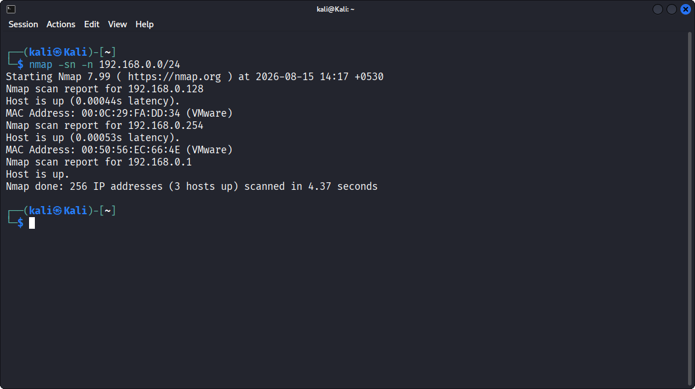
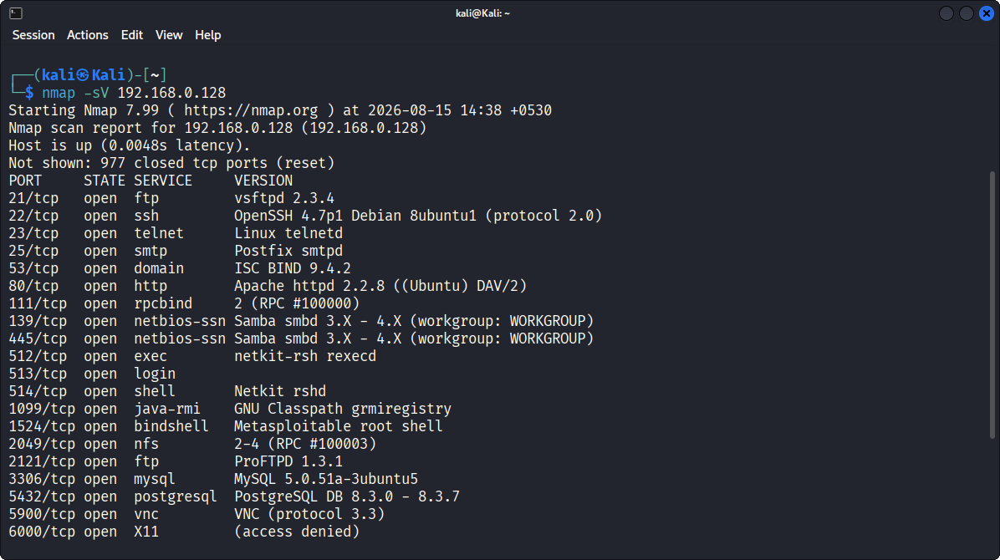
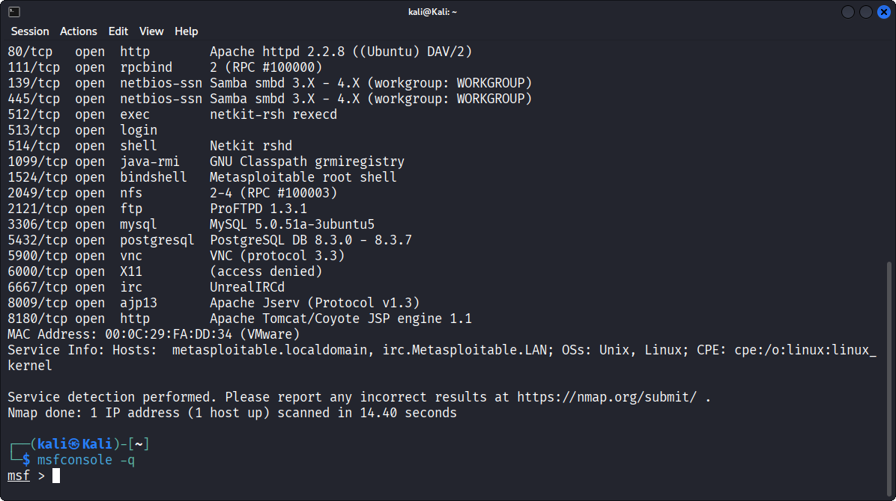
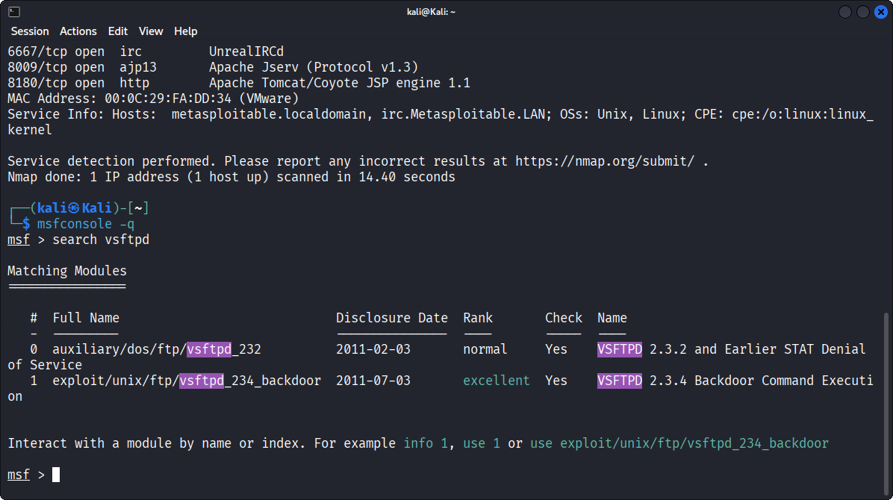
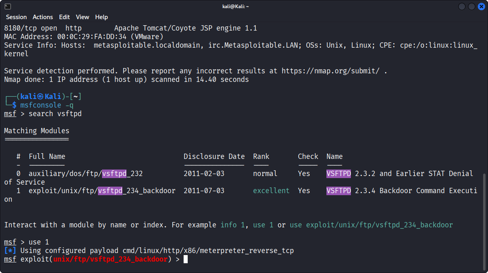
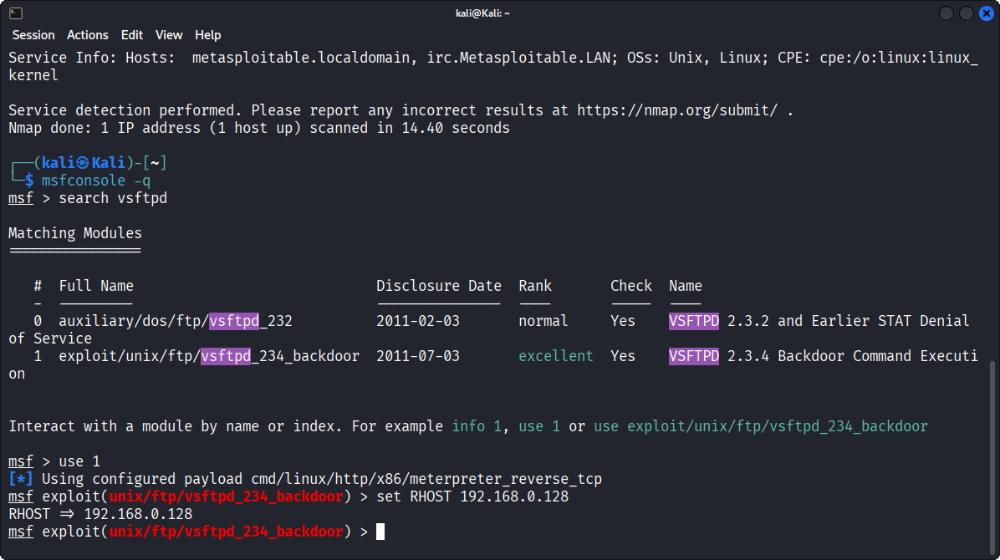
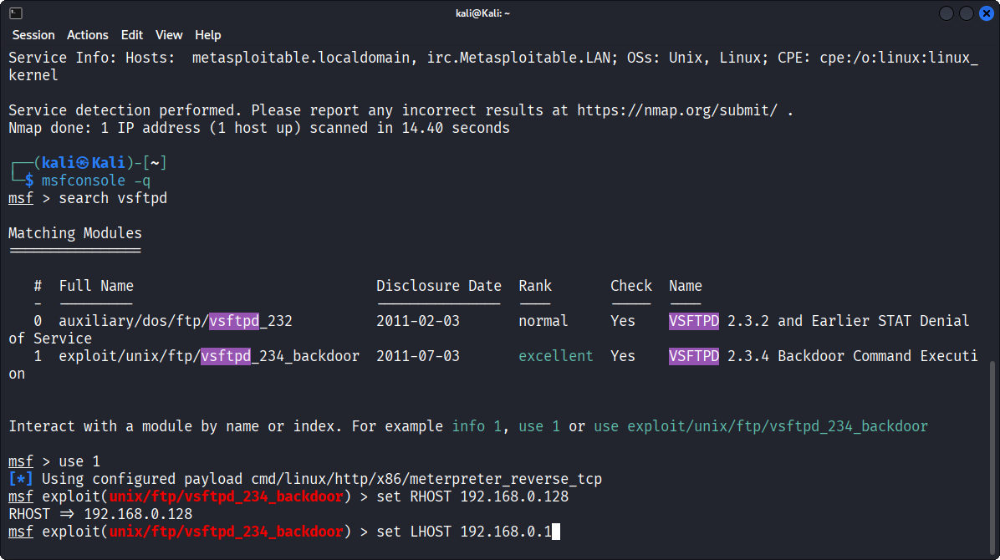
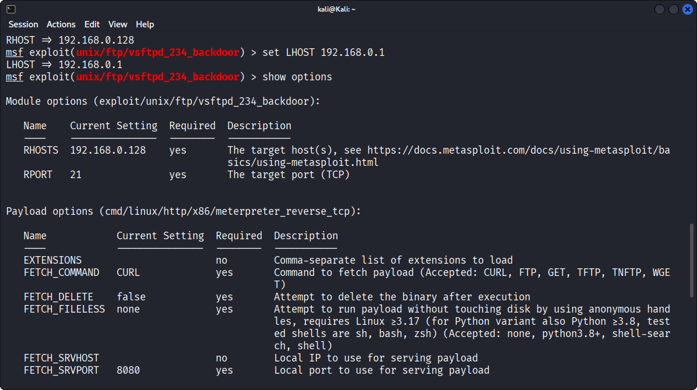

# Exploiting vsftpd on Metasploitable
Gaining  a Remote shell by Exploiting the VSFTPD Backdoor Vulnerability on a Metasploitable Machine Using the Metasploitable Framework.

# Router Device Scan

<p align = "center">router_device_scan0.1.png</p>

### Command
```bash
nmap -sn -n 192.168.0.0/24
```
### Parameters
- `-sn` : Ping scan only — checks which hosts are alive, skips port scanning.
- `-n`  : Skips DNS resolution, making the scan faster.
- `192.168.0.0/24` : Target subnet in CIDR notation, covering all 256
  possible addresses in that network range.

### Observation
- The scan completed in 4.37 seconds and found 3 hosts up out of 256
addresses scanned:
 
| IP Address    | MAC Address        | Likely Role                  |
|---------------|---------------------|-------------------------------|
| 192.168.0.1   | —                   | Router/Gateway                |
| 192.168.0.128 | 00:0C:29:FA:DD:34 (VMware) | Target (Metasploitable2) |
| 192.168.0.254 | 00:50:56:EC:66:4E (VMware) | Another VM on the network |
 
Both `.128` and `.254` show VMware MAC address prefixes, confirming they
are virtual machines on the host-only/NAT network. I identified
`192.168.0.128` as the Metasploitable2 target based on this.

### Why Is This Important:
- The purpose of running this command was to identify which machines are
actually alive on the network before doing anything else. Scanning a
/24 subnet means 256 possible addresses — without this step, I would be
guessing at IPs or wasting time scanning dead/non-existent hosts. This
scan immediately narrowed the target search down from 256 possibilities
to just 3 real, reachable machines, and the MAC address vendor info
(VMware) helped me distinguish which hosts were virtual machines relevant
to my lab, versus the physical router.

### What I Learned
- Reconnaissance should always start broad and narrow down gradually. A
lightweight ping sweep is the right first move because it's fast (under 5
seconds here) and doesn't waste time probing ports on dead hosts. I also
learned that MAC address vendor identification (like the "VMware" tag) is
a useful clue for pinpointing which host is actually my intended lab
target when multiple machines respond on the same network.
 
---
# Target IP Port Scan 

<p align= "center">port_&_version_scan0.2.png</p>

### command
```bash
nmap -sV 192.168.0.128
```
### Parameters
- `-sV` : Probes open ports to detect the **service and version** running
  on each (e.g., vsftpd 2.3.4, Apache 2.2.8).
- `192.168.0.128` : The confirmed target IP from the previous host
  discovery step.
- Default scan covers the top 1000 common ports — full port scan wasn't needed since the target already showed 23 open ports here.

### Observation 
- The scan found the host up with 23 open port out of the 1000 scanned (977 closed).
- The port that mattered most to me port 21, running vsftpd 2.3.4. This is the exact version I came here to exploit.
- Full list of open ports:

| Port | Service | Version Detected |
|------|---------|-------------------|
| 21   | ftp     | **vsftpd 2.3.4** |
| 22   | ssh     | OpenSSH 4.7p1 Debian 8ubuntu1 |
| 23   | telnet  | Linux telnetd |
| 25   | smtp    | Postfix smtpd |
| 53   | domain  | ISC BIND 9.4.2 |
| 80   | http    | Apache httpd 2.2.8 (Ubuntu) DAV/2 |
| 139/445 | netbios-ssn | Samba smbd 3.X - 4.X |
| 1099 | java-rmi | GNU Classpath grmiregistry |
| 1524 | bindshell | **Metasploitable root shell** |
| 2121 | ftp     | ProFTPD 1.3.1 |
| 3306 | mysql   | MySQL 5.0.51a-3ubuntu5 |
| 5432 | postgresql | PostgreSQL DB 8.3.0 - 8.3.7 |
| 5900 | vnc     | VNC (protocol 3.3) |
| 6000 | X11     | (access denied) |

### Why Is This Important:
- The purpose of this scan was to find out exactly what services are running
on the target and their exact versions. Version numbers are critical —
they're what let you match a service to a known, publicly documented
vulnerability. Without this step, I wouldn't have known that vsftpd
2.3.4 specifically was present, or that it's the backdoored version. The
scan also revealed the broader attack surface (23 open services), showing
just how many potential entry points a misconfigured or intentionally
vulnerable system can expose.

### What I Learned
- I learned that service version detection is the bridge between recon and
exploitation — it turns "a port is open" into "this port is exploitable."
I also learned that a single machine can expose an unusually large number
of services (like Telnet, rsh, and even a service literally named
"Metasploitable root shell"), and that outdated software versions are the
biggest giveaway when hunting for a way in. This scan gave me a full map
of the attack surface before I committed to exploiting any one service.
 
---

# Metasploit Console

<p align="center">msfconsole_launch0.3.png</p>

### Commands
```bash
msfconsole -q
```
### Parameters
- `msfconsole` : Launches the Metasploit Framework's interactive command-line console, which gives access to its full database of exploits, payloads, and auxiliary modules.
- `-q` : Quite mode — skips the ASCII art banner and startup tips, so the console loads faster and cleaner.

### Observation
- The console launched and dropped me into the msf> prompt, ready to accept commands. It skipped the usual startup banner since I used the -q flag.

### Why Is This Important:
- This is the entry point into the actual exploitation phase. Everything before this (network scan, version scan, vulnerability identification) was recon — this is where I move from gathering information to using a tool to act on that information. Metasploit is ehat lets me actually  select and run the exploit against vsftpd 2.3.4.

### What I Learned:
- I learned that Metasploit runs as its own interactive shell rather than individual one-off commands — once inside msfconsole, you work entirely within its own command set (search, use, set, run, etc.) instead of regular bash commands. Using -q also showed me that even small flags can make repeated workflows faster by skipping unnecessary output.


---

# Search Vsftpd

<p align = "center" >msf_search_vsftpd0.4.png</p>

### Commands
```bash
search vsftpd
```
### Parameters
- `search` : Metasploit's built-in command to look through its exploit/auxiliary/payload database for a keyword match.
- `vsftpd` : The keyword, searches for any module related to vsftpd, the FTP service found during scanning.

# Observation
- The search returned two matching modules. The first one was auxiliary/dos/ftp/vsftpd_232, disclosed on 2011-02-03, ranked normal, described as a VSFTPD 2.3.2 and Earlier STAT Denial of Service module. The second one was exploit/unix/ftp/vsftpd_234_backdoor, disclosed on 2011-07-03, ranked excellent, described as VSFTPD 2.3.4 Backdoor Command Execution.

- The second module was exactly what I needed, it directly matches the vsftpd 2.3.4 version identified during the scan, and it's ranked excellent, meaning Metasploit considers it a highly reliable exploit. Metasploit even suggested the exact command to load it, use exploit/unix/ftp/vsftpd_234_backdoor.

# Why Is This Important:
- This step confirmed that a ready-made, tested exploit module exists for the exact vulnerability I identified earlier. The first result, vsftpd_232, was a denial-of-service module, not useful for gaining access, so it was important to pick the right module and not just the first one that showed up. The excellent rank also mattered, since it told me this exploit is stable and unlikely to crash the target.

# What I Learned:
Metasploit's search results give more than just a list of names, the rank and disclosure date help decide which module actually fits the goal. I also learned to read the module type carefully, auxiliary versus exploit. Auxiliary modules like the DoS one don't give access, while exploit modules like vsftpd_234_backdoor are built to actually compromise the target.

---

# Msf Use Module

<p align="Center">msf_use_module0.5.png</p>

# Commands
```bash
use 1
```
# Parameters
- `use`- Metasploit's command to load a specific module into the current session, making it the active module you're working with.
- `1`- The index number of the module from the search results list, instead of typing the full path exploit/unix/ftp/vsftpd_234_backdoor, I used its shortcut number 1 shown in the search output.

# Observation
Metasploit loaded the module and automatically configured a default payload, cmd/linux/http/x86/meterpreter_reverse_tcp. The prompt also changed from msf > to msf exploit(unix/ftp/vsftpd_234_backdoor) >, confirming the module is now active and I'm working inside it.

# Why Is This Important:
- Loading the module is what actually puts me in position to configure and run the exploit. The prompt change matters too, it's a visual confirmation that every command I type from here on will apply specifically to this exploit, not to Metasploit in general. I also noticed Metasploit picked a default payload on its own, which told me it already has a sensible starting configuration before I even set anything manually.

# What I Learned:
- I learned that using the index number (1) instead of the full module path is a quicker way to load a module once you've already seen it in a search result. I also learned that Metasploit auto-selects a default payload for exploits, which means I need to check what's already configured with options or show payloads before assuming I have to set one manually.

---
# RHOST Set

<p align ="center">msf_set_RHOST0.6.png</p>

# Commands
```bash
set RHOST 192.168.0.128
```

# Parameters
- `set`-Metasploit's command to configure an option/variable for the currently loaded module.
- `RHOST`- Stands for Remote Host, this is the option that tells the exploit which IP address to attack.
- `192.168.0.128`- The target's IP address, confirmed earlier during the host discovery and version scan steps.

# Observation
- Metasploit confirmed the value was set by returning RHOST => 192.168.0.128. The prompt stayed the same, exploit(unix/ftp/vsftpd_234_backdoor), showing the module is still active and now has its target configured.
# Why Is This Important:
Every exploit module needs to know exactly which machine to attack, without setting RHOST, the exploit has no destination and can't run. This step directly connects everything from the recon phase, network scan and version scan, to the actual attack, the IP I found earlier is now plugged into the tool that will exploit it.
# What I Learned:
I learned that Metasploit options like RHOST aren't automatically filled in, even after loading the right module, you still have to manually configure the target based on what you found during recon. This also showed me how the earlier scanning steps directly feed into the exploitation phase, the IP address wasn't just a random detail, it was information I needed later.

---

# LHOST Set

<p align = "center">msf_set_LHOST0.7.png</p>

# Commands
```bash
set LHOST 192.168.0.1
```
# Parameters
- `set` - Metasploit's command to configure an option for the currently loaded module.
- `LHOST` - Stands for Local Host, this tells the payload which IP address to connect back to once the exploit succeeds, in this case my own Kali machine's IP.
- `192.168.0.1` - My attacker machine's IP address on the same network as the target.

# Observation
- Metasploit accepted the value and set LHOST accordingly. The prompt remained exploit(unix/ftp/vsftpd_234_backdoor), confirming the module now has both RHOST (target) and LHOST (my machine) configured, ready for the exploit to run.

# Why Is This Important:
- RHOST tells the exploit where to attack, but LHOST is just as critical for payloads that need a connection back to the attacker, like the meterpreter_reverse_tcp payload that was auto-configured earlier. Without a correct LHOST, even if the exploit succeeds on the target, I'd never actually get a shell back, the target wouldn't know where to send the connection.

# What I Learned:
I learned the difference between RHOST and LHOST clearly through this step, RHOST is always the victim, LHOST is always me. This also showed me that some exploits (especially reverse-shell based ones) need the attacker to be reachable by the target, not just the other way around, which matters for network setup in real scenarios too.

---

# Show Options

<p align="center">msf_show_options0.8.png)</p>

# Commands
```bash
Show Options
```
# Parameters
- `show` - Metasploit's command to display information, in this case configured options for the current module.
- `options` - Tells show to display the module's configurable settings, both exploit options and payload options, along with their current values.
# Observation
- The output listed two sections. Under Module options, RHOSTS was set to 192.168.0.128 and RPORT was 21, both marked as required and confirmed correctly configured. Under Payload options for cmd/linux/http/x86/meterpreter_reverse_tcp, several settings appeared including FETCH_COMMAND set to CURL, FETCH_DELETE set to false, and FETCH_SRVPORT set to 8080, among others related to how the payload gets delivered to the target.

# Why Is This Important:
- Before running the exploit, it's important to double check that every required option actually has a value, especially RHOSTS and RPORT, since a missing or wrong value would cause the exploit to fail or hit the wrong target entirely. This step let me confirm both RHOST and LHOST were correctly applied from the previous two commands, and also showed me settings I hadn't manually touched, like FETCH_COMMAND, which Metasploit had already configured with sensible defaults.

# What I learned:
- I learned that show options is a good habit to run right before launching an exploit, it's a final sanity check that catches mistakes early instead of finding out an option was wrong after the exploit fails. I also learned that payloads have their own separate set of options beyond just LHOST/LPORT, in this case settings related to how the payload binary gets fetched and delivered onto the target machine.

---

# Check Vulnerability


 


  


